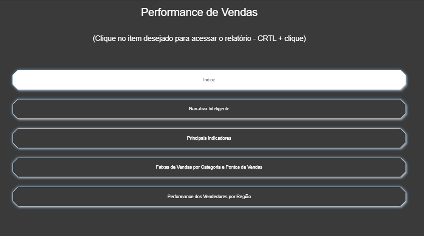
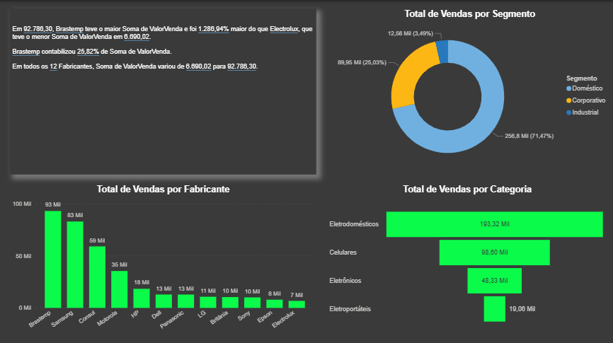
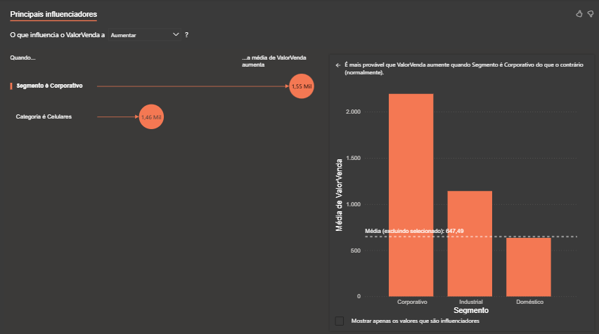
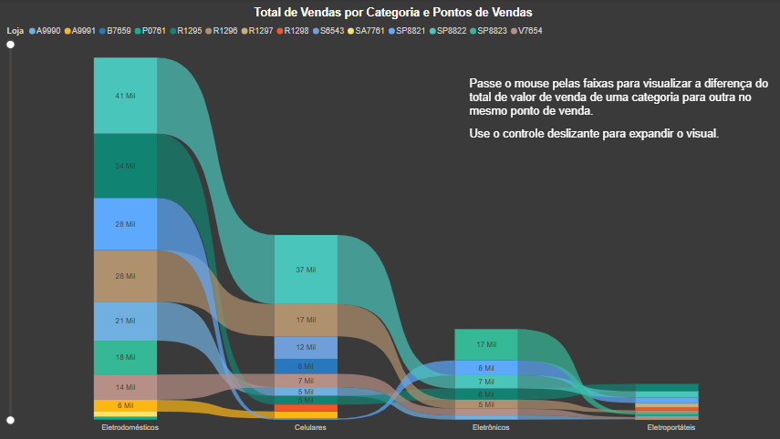
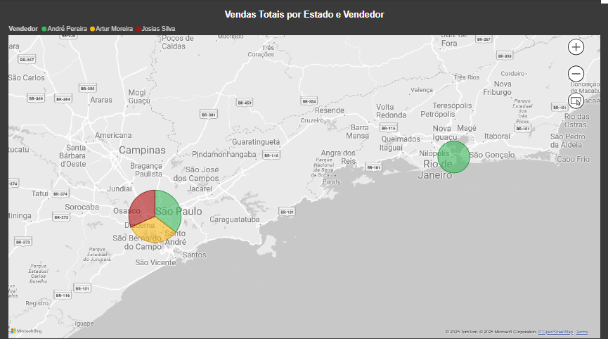

# Análise de Vendas

## Visão Geral do Projeto

Este dashboard foi desenvolvido no Power BI para análise de dados de vendas, apresentando insights sobre performance por diferentes dimensões: categorias, segmentos, fabricantes, regiões e vendedores. O projeto inclui um **índice de navegação** que permite acesso rápido às diferentes páginas de análise através de botões interativos.

---

## 📊 Análise Detalhada das Visualizações

### 1. Performance de Vendas

**Tipo de Visualização:** Índice de Navegação  
**Justificativa:** Interface de navegação criada para facilitar o acesso às diferentes páginas do dashboard, melhorando a experiência do usuário.

**Funcionalidades:**
- Índice principal com acesso direto às seções
- Narrativa Inteligente para insights automáticos
- Principais Indicadores para KPIs essenciais
- Faixas de Vendas por Categoria e Pontos de Vendas
- Performance dos Vendedores por Região

---

### 2. Análise Consolidada - Segmentos, Fabricantes e Categorias

**Tipos de Gráfico:** Gráfico de Rosca, Gráficos de Barras e Funil  
**Justificativa:** Combinação de visualizações para mostrar proporções (donut) e comparações absolutas (barras).

**Insights por Segmento:**
- **Doméstico:** 71.47% das vendas (258.6 Mi) - maior fatia do mercado
- **Corporativo:** 25.03% (89.85 Mi) - segmento com alto valor médio
- **Industrial:** 3.49% (12.56 Mi) - menor participação mas potencial nicho

**Insights por Fabricante:**
- **Brastemp:** líder absoluto com 93 Mi em vendas
- **Samsung:** segundo colocado com 63 Mi
- **CCE, Motorola, LG** e outros: participações menores
- Concentração de mercado nos dois principais fabricantes

**Insights por Categoria:**
- **Eletrodomésticos:** 193.32 Mi - categoria dominante (verde)
- **Celulares:** 69.69 Mi - segunda categoria mais relevante (azul claro)
- **Eletrônicos:** 43.32 Mi - terceira posição (verde claro)
- **Eletrodomésticos:** 19.06 Mi - menor categoria

**Observações Importantes:**
- Brastemp tem maior Soma de ValorVenda (25.82%) comparado a Electrolux
- Em todos os 12 Fabricantes, a Soma de ValorVenda variou de 6.960,02 para 92.788,30
- Total geral: 62.789,30 em vendas consolidadas

---

### 3. Principais Influenciadores

**Tipo de Gráfico:** Principais Influenciadores  
**Justificativa:** Utilizado para identificar os fatores que mais impactam o valor das vendas, permitindo análise de correlação e identificação de outliers.

**Insights Principais:**
- **Segmento Corporativo** é o principal influenciador, aumentando as vendas em 1.55 Mi
- **Categoria Celulares** também apresenta impacto significativo (1.04 Mi)
- O gráfico de barras à direita mostra a distribuição por segmento:
  - Corporativo liderando com aproximadamente 2.500 unidades
  - Industrial e Doméstico com volumes menores
- A média de referência está em 647.46, servindo como benchmark para análise
- O visual permite identificar rapidamente quais fatores impulsionam o crescimento das vendas

---

### 4. Total de Vendas por Categoria e Pontos de Vendas

**Tipo de Gráfico:** Sankey Diagram  
**Justificativa:** Escolhido para mostrar o fluxo de vendas desde as categorias até os pontos de venda, permitindo visualizar a distribuição e a intensidade dos relacionamentos entre diferentes dimensões.

**Insights Principais:**
- **Eletrodomésticos** representa o maior volume de vendas (193.32 Mi), demonstrando ser a categoria principal
- **Celulares** apresenta 69.69 Mi em vendas, ocupando a segunda posição
- **Eletrônicos** (43.32 Mi) e **Eletrodomésticos** (16.06 Mi) completam o portfólio
- O fluxo mostra uma distribuição concentrada em poucos pontos de venda principais
- Há uma clara hierarquia de performance entre as categorias
- As conexões mais espessas indicam maior volume de transações

---

### 5. Vendas Totais por Estado e Vendedor

**Tipo de Gráfico:** Mapa Geográfico
**Justificativa:** Ideal para análise geográfica, permitindo identificar concentrações regionais de vendas e performance por localização.

**Insights Geográficos:**
- **São Paulo:** maior concentração de vendas (bolha verde grande no mapa)
- **Minas Gerais:** segunda região em importância (bolha média)
- **Rio de Janeiro:** terceira posição regional
- Presença em múltiplos estados brasileiros, indicando cobertura nacional
- Concentração nas regiões Sudeste, principal mercado consumidor

**Insights dos Vendedores:**
- **André Pereira, Artur Moreira e Josias Silva:** três vendedores principais identificados na legenda
- Distribuição geográfica estratégica dos vendedores
- Performance diferenciada por região com foco no eixo Sul-Sudeste

---

## 💡 Conclusões e Recomendações Estratégicas

### Pontos Fortes:
1. **Dominância em Eletrodomésticos:** Categoria representa mais de 50% das vendas totais
2. **Foco no Mercado Doméstico:** 71% das vendas concentradas neste segmento
3. **Liderança da Brastemp:** Parceria estratégica bem-sucedida
4. **Cobertura Nacional:** Presença em múltiplos estados

### Oportunidades de Crescimento:
1. **Expansão no Segmento Industrial:** Apenas 3.49% de participação
2. **Diversificação de Fabricantes:** Reduzir dependência de Brastemp/Samsung
3. **Crescimento em Eletrônicos:** Categoria com potencial de expansão
4. **Desenvolvimento Regional:** Fortalecer presença fora do eixo Sul-Sudeste

### Estrutura Técnica do Dashboard:
- **Navegação Intuitiva:** Índice facilita acesso às diferentes análises
- **Múltiplas Perspectivas:** Visões por categoria, segmento, região e vendedor
- **Visualizações Adequadas:** Cada gráfico escolhido conforme o tipo de análise necessária
- **Interatividade:** Filtros e drill-down para análises detalhadas

---

## 📊 Sobre o Projeto

1. Faça o download do arquivo `analise_vendas.pbix`
2. Abra no Power BI Desktop
3. Atualize a fonte de dados apontando para o arquivo `Dados_Comerciais.xlsx`
4. Explore os insights interagindo com os filtros e visualizações

**Dataset:** Dados comerciais fictícios contendo informações de vendas por categoria, segmento, fabricante, região e vendedor.

---

## 👨‍💼 Autor

**Desenvolvido por:** Nathanny Soares.

---

## 🎓 Créditos

Este projeto foi desenvolvido com base nos conhecimentos adquiridos no curso de **Data Science Academy (DSA)**

---

⭐ Se este projeto foi útil para você, considere dar uma estrela no repositório!
